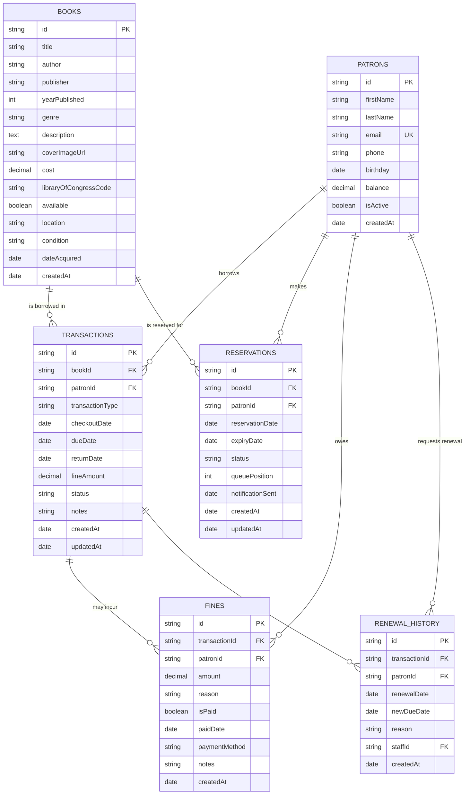

# Library Information System - Entity Relationship Diagram

## Entity Descriptions

### Core Entities

**PATRONS**

- Library members who can borrow books
- Includes contact information, membership details, and account balance

**BOOKS**

- Physical and digital items in the library collection
- Includes bibliographic information, availability status, and physical condition

**TRANSACTIONS**

- Records of all checkout, return, and renewal activities
- Tracks dates, status, and any associated fines

**RESERVATIONS**

- Queue system for patrons to reserve books that are currently unavailable
- Includes expiry dates and notification tracking

### Supporting Entities

**FINES**

- Financial penalties for late returns or damaged items
- Links to transactions and tracks payment status

### Operational Entities

**RENEWAL_HISTORY**

- Historical record of all renewal requests
- Supports renewal limits and approval workflows

## Key Relationships

3. **One-to-Many**: Patrons → Transactions, Reservations, Fines
4. **One-to-Many**: Books → Transactions, Reservations

## Business Rules Enforced

- A book can only have one active checkout transaction
- Patrons can have multiple reservations but limited active checkouts
- Fines are automatically calculated based on transaction data
- Reservation queue position is maintained automatically
